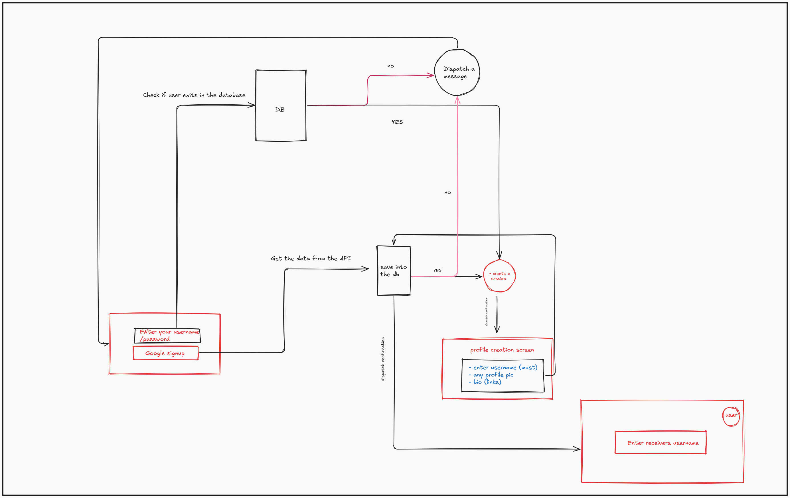
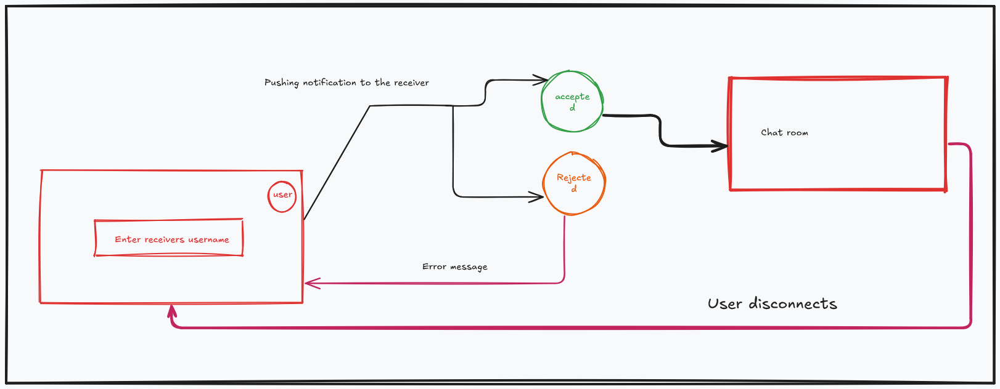

# High-Level Design (HLD) Document

# Purpose

This document outlines the high-level architecture and design of the project, covering the key components, their interactions, and how they fulfill the functional requirements of authentication, real-time messaging, and push notifications.

# System Overview

## Functional Modules

- **Authentication Module**: Manages user registration, login, and session management.
- **Chatting Module**: Facilitates real-time messaging between users.
- **Notification Module**: Sends push notifications to users about new messages or events.

## **Non-Functional Requirements**

- **Scalability**: The system must handle a large number of concurrent users.
- **Security**: Secure communication channels, data encryption, and robust authentication mechanisms.
- **Availability**: High availability to ensure users can access the chat service at all times.
- **Performance**: Low latency in message delivery and notification sending.

# System Architecture

## Component Breakdown

### **Client Application**

The frontend interface through which users interact with the application (web, mobile).

### **Backend**

**Services -**

- **Authentication Service**: Handles user credentials, session tokens (JWT), and security.
- **Chat Service**: Manages real-time messaging, chat rooms, and message persistence.
- **Notification Service**: Responsible for pushing notifications to users.
- **Database**: Stores user data, message history, and chat room information.
- **WebSocket Server**: Facilitates real-time communication between clients and the server.

# Component Interactions

## Authentication Flow

- **User Registration and Login**: Users register and authenticate using email/username and password. Upon successful login, a JWT is issued.
- **Session Management**: JWTs are used to maintain user sessions. Token refresh mechanisms are in place to ensure security.
  ### Diagram
  

## Chatting Flow

- **Message Exchange**: Real-time messages are exchanged between users via WebSocket. The server routes messages to the intended recipient.
- **Message History**: Messages are not stored initially but rather a button is provided to take the backup of all the messages to google drive or some other cloud service
  ### Diagram
  

## 🚧 Notification Flow

- **Event Triggering**: Notifications are triggered by events such as a new message, friend request, or user mention.
- **Push Notification Delivery**: Notifications are delivered to users' devices via web push or an email.

# Integration Points

## External Services

- **OAuth Providers**: Integration with external OAuth providers (e.g., Google, Facebook) for authentication.
- **Push Notification Services**: Integration with Firebase Cloud Messaging (FCM) for mobile notifications

# Security Considerations

## Auth and Data Encryption

Use of JWT for secure user authentication. Encryption of sensitive data like password, both in transit (using TLS) and at rest (using database encryption).

## Secure Communication

All communication between the client and server uses HTTPS and WebSocket Secure (WSS).

Providing end to end encryption between communication
